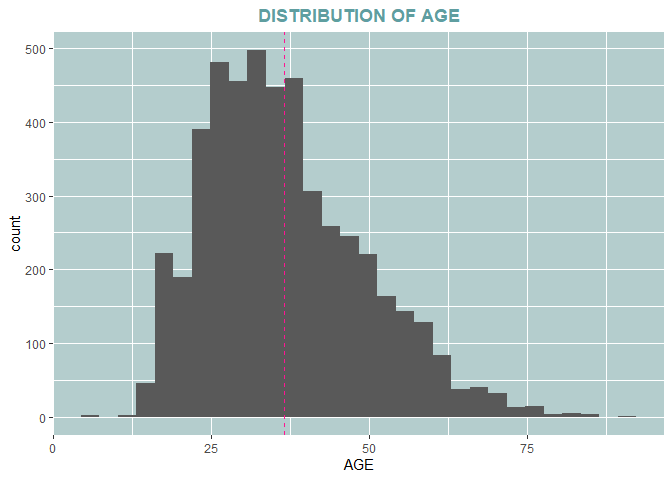
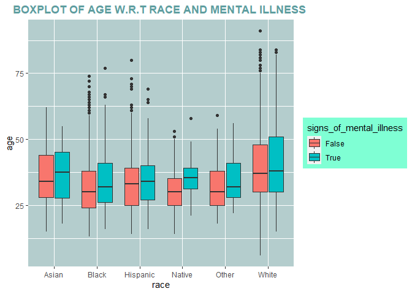
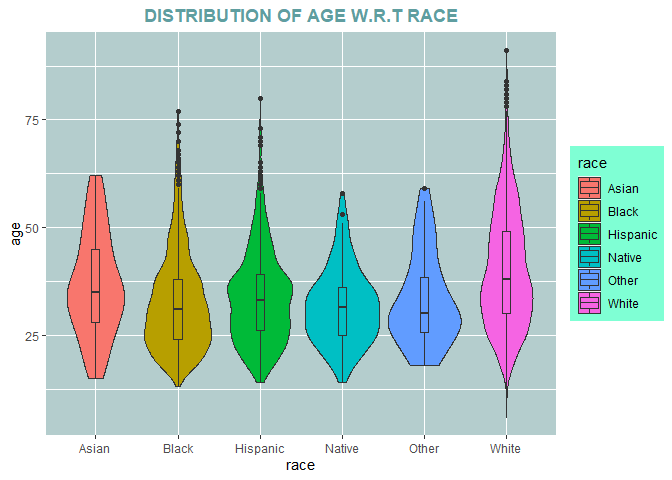
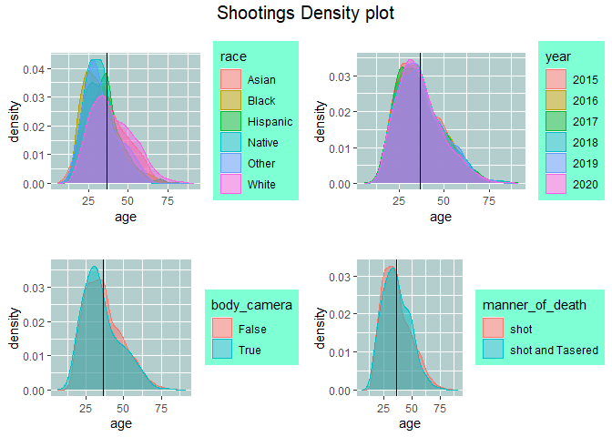

Data visualization using ggplot2
================
kipngenokoech
7/10/2021

## Introduction

Data visualization is presentation of data and information in pictorial
format.The visual elements like charts ,graphs and maps provides an easy
way of understanding the data you are working with.

some of the advantages of data visualization includes:

  - Better analysis.

  - Quick action.

  - Identifying patterns.

  - Finding errors.

  - Understanding the story.

  - Exploring business insights.

  - Grasping the Latest Trends.

## Reading data and loading packages

``` r
library(gridExtra)
library(grid)
library(plyr)
library(tidyverse)
crime<-read.csv("shootings.csv")
```

We are required to convert a number of variables to factors

``` r
#function to convert variables to factors
to.factors <- function(df, variables){
  for (variable in variables){
    df[[variable]] <- as.factor(df[[variable]])
  }
  return(df)
}
```

``` r
categorical<-c("manner_of_death","armed","gender","race","city","state","signs_of_mental_illness","flee","body_camera","arms_category")
crime<-to.factors(df= crime,variables =categorical)
```

``` r
#Extract year from date
crime$date <- as.Date(crime$date)
crime$year <- as.numeric(format(crime$date, "%Y"))
crime$year<-as.factor(crime$year)
crime<-crime[-c(1,3,12)]
```

\#\#data visualization

``` r
#checking the random sampling of data
crime[sample(nrow(crime),10),]
```

    ##                      name  manner_of_death   armed age gender  race
    ## 1766        Brian Gaither             shot unknown  24      M White
    ## 4508            Troy Kirk             shot   knife  31      M White
    ## 4775   Marcus Eugene Epps             shot   knife  43      M White
    ## 94          Sawyer Flache             shot     gun  27      M White
    ## 1035     Randolph McClain             shot     gun  33      M Black
    ## 1567           Chad Irwin             shot   knife  40      M White
    ## 2829 Joseph Edward Haynes             shot unarmed  16      M White
    ## 276        Colby Robinson             shot unknown  26      M Black
    ## 249          Donald Hicks shot and Tasered     gun  63      M White
    ## 3293  John Francis Murphy             shot     gun  41      M White
    ##                 city state signs_of_mental_illness        flee body_camera
    ## 1766  Grand Junction    CO                   False         Car       False
    ## 4508       Lancaster    OH                    True Not fleeing        True
    ## 4775        Anderson    SC                   False       Other       False
    ## 94            Austin    TX                   False Not fleeing       False
    ## 1035            Lynn    MA                   False       Other       False
    ## 1567        Antelope    CA                   False Not fleeing       False
    ## 2829 Franklin County    OH                   False Not fleeing       False
    ## 276           DeSoto    TX                   False        Foot       False
    ## 249       Metropolis    IL                    True Not fleeing       False
    ## 3293     Grand Forks    ND                    True Not fleeing       False
    ##      arms_category year
    ## 1766       Unknown 2016
    ## 4508 Sharp objects 2019
    ## 4775 Sharp objects 2020
    ## 94            Guns 2015
    ## 1035          Guns 2016
    ## 1567 Sharp objects 2016
    ## 2829       Unarmed 2018
    ## 276        Unknown 2015
    ## 249           Guns 2015
    ## 3293          Guns 2018

## Data Exploration using GGPLOT

``` r
attach(crime)
ggplot(crime,aes(x=age))+geom_histogram()+labs(title = "DISTRIBUTION OF AGE",x="AGE")+theme(panel.background = element_rect(fill = "lightcyan3"),plot.title = element_text(hjust = 0.5,face = "bold",colour = "cadetblue"))+geom_vline(data=crime, aes(xintercept = mean(age)),linetype="dashed",color="deeppink")
```

<!-- -->

The distribution of ages is somehow symmetrical but the tail is longer
on the right side which makes it positively skewed.

``` r
#checking presence of outliers using boxplot

ggplot(crime,aes(x=race,y=age,fill=signs_of_mental_illness))+geom_boxplot()+theme(panel.background = element_rect(fill = "lightcyan3"),plot.title = element_text(hjust = 0.5,face = "bold",colour = "cadetblue"),legend.background = element_rect(fill="aquamarine"))+labs(title = "BOXPLOT OF AGE W.R.T RACE AND MENTAL ILLNESS ")
```

<!-- -->

The victims with mental illness have higher age on average compared to
victims without mental illness.

``` r
ggplot(crime,aes(x=race,y=age,fill=race))+geom_violin()+geom_boxplot(width=0.1)+theme(panel.background=element_rect(fill="lightcyan3"),plot.title=element_text(hjust=0.5,colour="cadetblue",face="bold"),legend.background = element_rect(fill="aquamarine"))+labs(title = "DISTRIBUTION OF AGE W.R.T RACE")
```

<!-- -->

A combination of boxplot and density plot. The shape of violin shows the
distribution of frequencies.From the plot above many data points cluster
around the median value.Boxplot depicts the five number summary,
maximum,minimum,median, 1st quartile and 3rd quartile.

``` r
p1<-ggplot(crime,aes(age,fill=race,colour=race))+geom_density(alpha=.5)+geom_vline(aes(xintercept=mean(age)))+labs(title = "AGE DENSITY PLOT W.R.T race")+theme(panel.background = element_rect(fill="lightcyan3"),plot.title = element_text(face = "bold",colour = "cadetblue",hjust = 0.5),legend.background = element_rect(fill="aquamarine"))
```

``` r
p2<-ggplot(crime,aes(age,fill=year,colour=year))+geom_density(alpha=.5)+geom_vline(aes(xintercept=mean(age)))+labs(title = "AGE DENSITY PLOT W.R.T year")+theme(panel.background = element_rect(fill="lightcyan3"),plot.title = element_text(face = "bold",colour = "cadetblue",hjust = 0.5),legend.background = element_rect(fill="aquamarine"))
```

``` r
p3<-ggplot(crime,aes(age,fill=body_camera,colour=body_camera))+geom_density(alpha=.5)+geom_vline(aes(xintercept=mean(age)))+labs(title = "AGE DENSITY PLOT W.R.T BODY CAM")+theme(panel.background = element_rect(fill="lightcyan3"),plot.title = element_text(face = "bold",colour = "cadetblue",hjust = 0.5),legend.background = element_rect(fill="aquamarine"))
```

``` r
p4<-ggplot(crime,aes(age,fill=manner_of_death,colour=manner_of_death))+geom_density(alpha=.5)+geom_vline(aes(xintercept=mean(age)))+labs(title = "AGE DENSITY PLOT W.R.T MANNER OF DEATH")+theme(panel.background = element_rect(fill="lightcyan3"),plot.title = element_text(face = "bold",colour = "cadetblue",hjust = 0.5),legend.background = element_rect(fill="aquamarine"))
```

``` r
grid.arrange(p1 + ggtitle(""),
             p2 + ggtitle(""),
             p3 + ggtitle(""),
             p4 + ggtitle(""),
             nrow = 2,
             top = textGrob("Shootings Density plot", 
                            gp=gpar(fontsize=15)))
```

<!-- -->

Density plot is used to show the distribution of one or more
variables.From the above we can observe that the distribution of our
variables have a long tail towards the right hence positively skewed
distributions.
